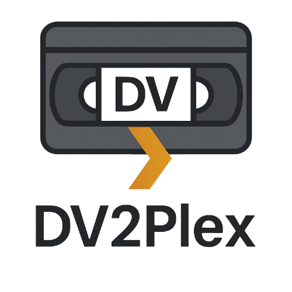

# DV2Plex 🎬

<div align="center">




**Professional digitization of MiniDV tapes with automatic upscaling and Plex export**

[Features](#-features) • [Installation](#-installation) • [Usage](#-usage) • [Development](#-development) • [Contributing](#-contributing) • [Credits](#-credits)

</div>

---

## 📖 Overview

DV2Plex is a modern, cross-platform application for digitizing MiniDV tapes. The software combines professional video capture technology with AI-based upscaling and automated export for Plex Media Server.

### Why DV2Plex?

- 🎥 **Complete Workflow**: From capture to finished Plex export in one application
- 🤖 **AI Upscaling**: Automatic upscaling to 4K with Real-ESRGAN
- 🎨 **Modern GUI**: Intuitive user interface with live preview
- 🔄 **Automation**: Automatic merging, upscaling, and exporting
- 📦 **Plex Integration**: Direct export in Plex standard format
- 🖼️ **Cover Generation**: Automatic cover creation with Stable Diffusion

---

## ✨ Features

### Core Features

- **Live Preview**: Real-time camera preview via DirectShow (Windows) or v4l2 (Linux)
- **DV Capture**: Professional video recording with ffmpeg (multiple parts possible)
- **Automatic Merging**: Seamless merging of multiple capture parts
- **4K Upscaling**: AI-based upscaling with Real-ESRGAN
- **Plex Export**: Automatic export in standard movie format
- **Cover Generation**: Automatic cover creation with Stable Diffusion

### Advanced Features

- **Multiple Upscaling Profiles**: From fast to highest quality
- **Batch Processing**: Processing multiple videos simultaneously
- **Progress Display**: Detailed progress display for all processes
- **Logging**: Comprehensive logging system for debugging
- **Configurable**: Flexible configuration via JSON files

---

## 🚀 Installation

### Prerequisites

- **Python 3.8+**
- **ffmpeg** (checked at startup)
- **FireWire camera** or DV device (for capture)
- **GPU** recommended (for faster upscaling, optional)

### Quick Start

#### 1. Clone Repository

```bash
git clone https://github.com/FutureMan0/ACR.git
cd dv2plex
```

#### 2. Install Dependencies

```bash
pip install -r requirements.txt
```

#### 3. External Tools (optional)

**ffmpeg:**
- **Linux**: `sudo apt-get install ffmpeg` or [static binary](https://johnvansickle.com/ffmpeg/)

**Real-ESRGAN Models:**
Will be automatically downloaded on first start.

#### 4. Start Application

```bash
python -m dv2plex
# or
python start.py
```

### Build as Standalone Application

See [docs/BUILD_ANLEITUNG.md](docs/BUILD_ANLEITUNG.md) for details on PyInstaller build.

```bash
./scripts/build.sh
```

---

## 📖 Usage

### Getting Started

1. **Connect Camera**: Connect FireWire camera via IEEE 1394
2. **Start Program**: `python -m dv2plex`
3. **Enter Title and Year**: In the Capture tab
4. **Start Preview** (optional): To verify connection
5. **Start Recording**: Click "Start Recording" button
6. **Control Tape**: Press play on camera
7. **Stop Recording**: Click "Stop Recording" button or wait until end of tape

### Workflow

```
Capture → Merge → Upscale → Plex-Export
```

All steps can be executed automatically or manually.

### Configuration

Configuration is done via `dv2plex/config/settings.json`. An example configuration can be found in `config/examples/Konfiguration_Beispiel.json`.

**Important Settings:**

- `paths.ffmpeg_path`: Path to ffmpeg (empty = system PATH)
- `paths.realesrgan_path`: Path to Real-ESRGAN (automatically detected)
- `paths.plex_movies_root`: Target directory for Plex export
- `upscaling.default_profile`: Default upscaling profile

### Upscaling Profiles

See [docs/Upscaling_Profile_Referenz.md](docs/Upscaling_Profile_Referenz.md) for a complete overview of all available profiles.

**Available Profiles:**
- `realesrgan_4x_hq`: Highest quality (slow)
- `realesrgan_4x_balanced`: Balance between quality and speed
- `realesrgan_4x_fast`: Fast (lower quality)
- `realesrgan_2x`: 2x upscaling (very fast)
- `ffmpeg_fast`: Only ffmpeg upscaling (very fast, low quality)

---

## 🛠️ Development

### Project Structure

```
dv2plex/
├── dv2plex/              # Main Python package
│   ├── app.py            # GUI main program
│   ├── capture.py        # Capture engine
│   ├── merge.py          # Merge engine
│   ├── upscale.py        # Upscale engine
│   ├── plex_export.py    # Plex export
│   ├── config.py         # Configuration management
│   └── ...
├── docs/                 # Documentation
├── scripts/              # Build scripts
├── config/              # Configuration examples
└── tests/               # Tests (planned)
```

### Development Setup

```bash
# Clone repository
git clone https://github.com/yourusername/dv2plex.git
cd dv2plex

# Create virtual environment
python -m venv venv
source venv/bin/activate  # Linux/Mac
# or
venv\Scripts\activate  # Windows

# Install dependencies
pip install -r requirements.txt

# Start development
python -m dv2plex
```

### Code Style

- **Python**: PEP 8
- **Type Hints**: Recommended for new functions
- **Docstrings**: Google-style for all public functions

### Tests

Tests are planned. See [CONTRIBUTING.md](CONTRIBUTING.md) for details.

---

## 🤝 Contributing

We welcome contributions! Please read [CONTRIBUTING.md](CONTRIBUTING.md) first for details.

### How can I contribute?

- 🐛 **Bug Reports**: Create an issue with detailed description
- 💡 **Feature Requests**: Discuss new features in issues
- 📝 **Documentation**: Improve documentation
- 🔧 **Code**: Send pull requests for bugfixes or features
- 🎨 **UI/UX**: Improvements to the user interface
- 🌍 **Translations**: Translate the application to other languages

### Pull Request Process

1. Fork the repository
2. Create a feature branch (`git checkout -b feature/AmazingFeature`)
3. Commit your changes (`git commit -m 'Add some AmazingFeature'`)
4. Push to the branch (`git push origin feature/AmazingFeature`)
5. Open a Pull Request

---

## 📝 License

This project is licensed under the MIT License. See [LICENSE](LICENSE) for details.

---

## 🙏 Credits

### Main Developer

- **Luis Blüml** - *Initial Developer* - [GitHub](https://github.com/yourusername)

### Dependencies & Libraries

- **[PySide6](https://www.qt.io/qt-for-python/)** - GUI Framework
- **[Real-ESRGAN](https://github.com/xinntao/Real-ESRGAN)** - AI-based upscaling
- **[ffmpeg](https://ffmpeg.org/)** - Video processing
- **[PyTorch](https://pytorch.org/)** - Deep Learning Framework
- **[Stable Diffusion](https://github.com/Stability-AI/stable-diffusion)** - Cover generation

### Inspiration

- Real-ESRGAN by [Xinntao](https://github.com/xinntao)
- Plex Media Server Community

---

### Known Issues

See [Issues](https://github.com/yourusername/dv2plex/issues) for known issues and planned fixes.

---

## 📞 Support

### Getting Help

- 📖 **Documentation**: See `docs/` directory
- 💬 **Issues**: [GitHub Issues](https://github.com/yourusername/dv2plex/issues)
- 💡 **Discussions**: [GitHub Discussions](https://github.com/yourusername/dv2plex/discussions)

### Common Problems

**ffmpeg not found:**
- Install ffmpeg system-wide or place it in `dv2plex/bin/ffmpeg/`

**Models not downloading:**
- Check internet connection
- Models are stored in `~/.cache/realesrgan/`

**Upscaling too slow:**
- Use a faster profile (e.g., `realesrgan_2x`)
- GPU is recommended for better performance

---

## 🌟 Stars & Sponsoring

If you like this project, consider marking it with a ⭐!

---

## 📄 Changelog

See [CHANGELOG.md](CHANGELOG.md) for a complete list of changes.

---

<div align="center">

**Made with ❤️ by the DV2Plex Community**

[⬆ Back to top](#dv2plex-)

</div>
